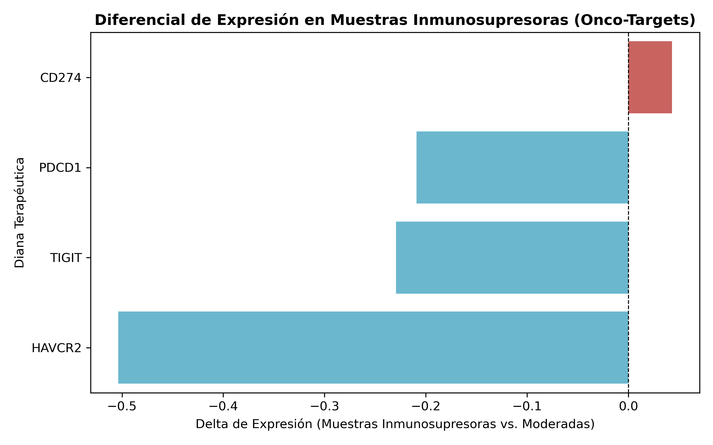

# 🧬 OncoTarget Mining Pipeline: Minería Transversal de Datos Genómicos Públicos Infrautilizados para la Identificación de Mecanismos de Evasión Inmune


---

## 📋 Resumen Ejecutivo

**OncoTarget Mining Pipeline** es una arquitectura *end-to-end* de **biología computacional, análisis transcriptómico y aprendizaje automático** diseñada para reutilizar datos genómicos públicos procedentes de repositorios como **European Nucleotide Archive (ENA)** y **NCBI Sequence Read Archive (SRA)**.

El proyecto parte de un atlas unicelular de referencia **PBMC 3k**, compuesto por **2.638 células**, para caracterizar firmas transcriptómicas asociadas a actividad citotóxica. A partir de estas firmas se entrena un clasificador supervisado **Random Forest**, posteriormente utilizado para proyectar perfiles funcionales sobre cohortes transcriptómicas independientes.

La pipeline se aplicó sobre múltiples BioProjects públicos, con especial atención a **PRJEB108071**, donde se analizaron **46 muestras/corridas SRA/FASTQ**:

- **32 muestras (69.57%)** fueron clasificadas como **Respuesta Moderada**.
- **14 muestras (30.43%)** fueron clasificadas como **Baja / Inmunosupresora**.
- **CD274 (PD-L1)** fue priorizado como el principal candidato entre los genes de evasión inmune evaluados.
- El delta de expresión observado para `CD274` fue de aproximadamente **+0.0430**.

La arquitectura fue posteriormente extendida a otros BioProjects para evaluar su capacidad de **minería transversal entre estudios independientes**.

> **Importante:** los resultados representan una **priorización computacional de candidatos** y una estrategia de generación de hipótesis. No constituyen por sí mismos una demostración de causalidad biológica ni una validación clínica.

---

# 🎯 Objetivo del Proyecto

El objetivo de **OncoTarget Mining Pipeline** es convertir datos transcriptómicos públicos disponibles en repositorios genómicos en información útil para la **generación y priorización de hipótesis biológicas**.

La estrategia combina:

1. **Análisis unicelular (scRNA-seq)**.
2. **Ingeniería de firmas transcriptómicas**.
3. **Machine Learning supervisado**.
4. **Minería automatizada de repositorios públicos**.
5. **Estratificación funcional de muestras**.
6. **Análisis de genes relacionados con evasión inmune**.
7. **Priorización computacional de potenciales onco-targets**.

La idea central es reutilizar datasets públicos que pueden contener información biológica relevante aunque no hayan sido generados originalmente para responder a la pregunta concreta de este proyecto.

---

# 🛠️ Arquitectura de la Pipeline

```text
┌───────────────────────┐
│    1. PBMC 3k Atlas   │
│      2,638 células    │
└───────────┬───────────┘
            │
            ▼
┌───────────────────────┐
│        Scanpy         │
│ Preprocesamiento +    │
│ firmas transcriptómicas│
└───────────┬───────────┘
            │
            ▼
┌───────────────────────┐
│    Random Forest      │
│ Clasificación de      │
│ perfiles citotóxicos  │
└───────────┬───────────┘
            │
            ▼
┌────────────────────────────┐
│       ENA / NCBI / SRA     │
│ Datos transcriptómicos     │
│ públicos e independientes  │
└────────────┬───────────────┘
             │
             ▼
┌───────────────────────┐
│ Predicción por        │
│ muestra               │
└───────────┬───────────┘
            │
            ▼
┌───────────────────────┐
│ Estratificación       │
│ funcional             │
│                       │
│ Alta / Media / Baja   │
│ citotoxicidad         │
└───────────┬───────────┘
            │
            ▼
┌──────────────────────────┐
│     Target Discovery     │
│                          │
│ CD274 / PDCD1 / TIGIT /  │
│ HAVCR2                   │
└────────────┬─────────────┘
             │
             ▼
┌──────────────────────────┐
│ Results / Reports        │
│ Markdown / CSV / JSON    │
└──────────────────────────┘
```

---

# 🔬 1. Análisis Unicelular — PBMC 3k

La primera etapa utiliza el atlas **PBMC 3k** como referencia para caracterizar patrones de expresión asociados a actividad citotóxica.

El procesamiento se realiza mediante **Scanpy** y se emplean marcadores funcionales como:

```text
NKG7
GZMA
CCL5
GNLY
PRF1
```

Estas señales transcriptómicas permiten construir perfiles asociados a actividad citotóxica que posteriormente sirven como base para el entrenamiento del modelo de Machine Learning.

El análisis de referencia utiliza una matriz de **2.638 células y 1.826 genes**.

---

# 🤖 2. Machine Learning — Random Forest

Sobre las firmas transcriptómicas derivadas del atlas de referencia se entrena un clasificador supervisado **Random Forest**.

El modelo permite categorizar perfiles funcionales en tres niveles:

| Categoría | Interpretación |
|:---|:---|
| 🟢 **Alta Citotoxicidad** | Perfil compatible con elevada actividad citotóxica |
| 🟡 **Respuesta Moderada** | Perfil funcional intermedio |
| 🔴 **Baja / Inmunosupresora** | Perfil de menor actividad citotóxica y mayor interés para análisis de evasión inmune |

El modelo entrenado se serializa como:

```text
onco_target_random_forest.joblib
```

La definición de las variables utilizadas por el modelo se conserva en:

```text
model_features.json
```

Esto permite mantener la correspondencia entre el modelo entrenado y las características transcriptómicas utilizadas durante la inferencia.

---

# 🌐 3. Minería de Datos Genómicos Públicos

La pipeline utiliza recursos públicos de:

- **European Nucleotide Archive (ENA)**
- **NCBI Sequence Read Archive (SRA)**
- **NCBI Entrez**
- **BioProject**

El script:

```text
01_fetch_genomic_metadata.py
```

se utiliza para automatizar parte de la recuperación de metadatos genómicos.

El objetivo es proyectar el modelo entrenado sobre muestras independientes y detectar patrones funcionales que puedan ser explorados posteriormente desde una perspectiva de evasión inmune.

La estrategia busca aprovechar datos públicos infrautilizados que pueden contener señales biológicas relevantes aunque no hayan sido generados originalmente para responder a la pregunta concreta del proyecto.

---

# 🧬 4. Estratificación Funcional

Una vez procesadas las muestras independientes, el modelo asigna cada muestra a un perfil funcional.

## BioProject PRJEB108071

La cohorte principal contiene:

**46 muestras/corridas SRA/FASTQ**

| Perfil Predicho | Muestras | Porcentaje |
|:---|---:|---:|
| **Respuesta Moderada** | 32 | 69.57% |
| **Baja / Inmunosupresora** | 14 | **30.43%** |
| **Total** | **46** | **100.00%** |

El grupo de baja citotoxicidad / inmunosupresor representa **14 de 46 muestras**, equivalente al **30.43%** de la cohorte.

Este subgrupo constituye la población de mayor interés para la etapa posterior de *Target Discovery*.

---

# 📊 Resultados Principales

## 1. Estratificación de PRJEB108071

```text
PRJEB108071
│
├── 32 muestras → Respuesta Moderada
│                 69.57%
│
└── 14 muestras → Baja / Inmunosupresora
                  30.43%
```

La clasificación identifica aproximadamente **3 de cada 10 muestras** de la cohorte como pertenecientes al perfil de baja citotoxicidad / inmunosupresor.

---

# 🎯 Target Discovery — Evasión Inmune

Para explorar posibles mecanismos moleculares asociados al perfil inmunosupresor se analizaron genes relacionados con regulación e inhibición de la respuesta inmune:

```text
CD274
PDCD1
TIGIT
HAVCR2
```

Los resultados obtenidos fueron:

| Target | Δ Expresión |
|:---|---:|
| **CD274 (PD-L1)** | **+0.042990** |
| PDCD1 (PD-1) | -0.209052 |
| TIGIT | -0.229288 |
| HAVCR2 (TIM-3) | -0.503626 |

## 🧬 CD274 (PD-L1)

Entre los candidatos evaluados, **CD274** fue el único que presentó un delta de expresión positivo en el subgrupo inmunosupresor.

```text
Δ Expresión = +0.042990
```

Por este motivo, **CD274 fue priorizado como el principal candidato computacional** identificado por el análisis.

El resultado es compatible con una hipótesis de evasión inmune asociada a la expresión de PD-L1 y proporciona un punto de partida para futuras investigaciones.

> **Interpretación:** CD274 debe considerarse un candidato priorizado para validación posterior, no una diana clínicamente validada por este estudio.

---

# 🌍 Minería Multi-BioProject

La pipeline fue evaluada sobre múltiples proyectos públicos para comprobar su capacidad de realizar análisis transversal entre estudios independientes.

| BioProject | Fuente | Total muestras | Inmunosupresoras | % Alto Riesgo |
|:---|:---|---:|---:|---:|
| **PRJEB108071** | Local / ENA | 46 | 14 | **30.43%** |
| **PRJNA720232** | ENA / NCBI SRA | 6 | 1 | **16.67%** |
| **PRJNA588993** | ENA / NCBI SRA | 3 | 0 | **0.00%** |

### Resumen

```text
PRJEB108071   → 46 muestras → 14 inmunosupresoras → 30.43%
PRJNA720232   →  6 muestras →  1 inmunosupresora  → 16.67%
PRJNA588993   →  3 muestras →  0 inmunosupresoras →  0.00%
```

La evaluación multi-BioProject demuestra la capacidad de la arquitectura para aplicar el mismo esquema analítico sobre datasets independientes.

Las diferencias observadas entre proyectos deben interpretarse teniendo en cuenta el contexto biológico, experimental y técnico de cada estudio.

---

# 🧪 Flujo Metodológico Completo

```text
                    ┌──────────────────────┐
                    │    PBMC 3k Atlas     │
                    │     2,638 células    │
                    │     1,826 genes      │
                    └──────────┬───────────┘
                               │
                               ▼
                    ┌──────────────────────┐
                    │       Scanpy         │
                    │ Preprocesamiento +   │
                    │ firmas citotóxicas   │
                    └──────────┬───────────┘
                               │
                               ▼
                    ┌──────────────────────┐
                    │    Random Forest     │
                    │ Modelo supervisado   │
                    └──────────┬───────────┘
                               │
                               ▼
              ┌────────────────────────────────┐
              │       ENA / NCBI / SRA         │
              │    Datos transcriptómicos      │
              │       públicos clínicos        │
              └───────────────┬────────────────┘
                              │
                              ▼
                    ┌──────────────────────┐
                    │ Predicción por       │
                    │ muestra              │
                    └──────────┬───────────┘
                               │
                               ▼
                    ┌──────────────────────┐
                    │ Estratificación      │
                    │ funcional             │
                    └──────────┬───────────┘
                               │
                               ▼
                    ┌──────────────────────┐
                    │ Target Discovery     │
                    │ CD274 / PDCD1 /      │
                    │ TIGIT / HAVCR2       │
                    └──────────┬───────────┘
                               │
                               ▼
                    ┌──────────────────────┐
                    │ Results + Reports    │
                    │ CSV / JSON / PNG /   │
                    │ Markdown             │
                    └──────────────────────┘
```

---

# 📁 Estructura Actual del Proyecto

La estructura actual del repositorio se mantiene deliberadamente sencilla para preservar las rutas utilizadas por el notebook de análisis.

```text
onco-target-scRNA/
│
├── README.md
├── requirements.txt
├── .gitignore
├── .gitattributes
│
├── 01_fetch_genomic_metadata.py
├── 01_onco_target_analysis.ipynb
│
├── data/
│   ├── ena_download_links.csv
│   ├── metastasis_metadata.csv
│   └── pbmc3k_raw.h5ad
│
├── pbmc3k_annotated.h5ad
│
├── onco_target_random_forest.joblib
├── model_features.json
│
├── mineria_multi_bioproject_resumen.csv
├── onco_targets_priorizados_evasion.csv
├── reporte_oncotargets_pbmc3k.csv
├── top10_oncotarget_genes.json
│
├── dianas_onco_targets_priorizadas.png
└── Informe_Tecnico_OncoTarget_Mining.md
```

---

# 📦 Descripción de los Principales Archivos

| Archivo | Función |
|:---|:---|
| `01_fetch_genomic_metadata.py` | Recuperación automatizada de metadatos genómicos |
| `01_onco_target_analysis.ipynb` | Notebook principal de análisis |
| `pbmc3k_raw.h5ad` | Datos PBMC 3k de referencia |
| `pbmc3k_annotated.h5ad` | Dataset PBMC 3k procesado/anotado |
| `onco_target_random_forest.joblib` | Modelo Random Forest entrenado |
| `model_features.json` | Variables/features utilizadas por el modelo |
| `mineria_multi_bioproject_resumen.csv` | Resumen de resultados entre BioProjects |
| `onco_targets_priorizados_evasion.csv` | Ranking de candidatos de evasión inmune |
| `reporte_oncotargets_pbmc3k.csv` | Resultados del análisis de targets sobre PBMC 3k |
| `top10_oncotarget_genes.json` | Ranking estructurado de candidatos |
| `dianas_onco_targets_priorizadas.png` | Visualización de resultados |
| `Informe_Tecnico_OncoTarget_Mining.md` | Informe técnico del análisis |

---

# 📈 Visualización de Resultados

El análisis genera una visualización de los candidatos priorizados:



Los resultados tabulares y estructurados se encuentran disponibles en los archivos CSV y JSON incluidos en el repositorio.

---

# 🧬 Firmas Biológicas

## Firma de Citotoxicidad

Los principales marcadores empleados son:

```text
NKG7
GZMA
CCL5
GNLY
PRF1
```

## Eje de Evasión Inmune

Los principales candidatos evaluados son:

```text
CD274
PDCD1
TIGIT
HAVCR2
```

Estos genes representan componentes asociados a actividad citotóxica y mecanismos de regulación/inhibición de la respuesta inmune.

---

# 💻 Tecnologías Utilizadas

| Tecnología | Función |
|:---|:---|
| **Python 3.10+** | Lenguaje principal |
| **Scanpy / AnnData** | Análisis de scRNA-seq |
| **NumPy** | Computación numérica |
| **Pandas** | Manipulación de datos |
| **Scikit-learn** | Machine Learning |
| **Random Forest** | Clasificación supervisada |
| **Gradio** | Interfaz / visualización interactiva |
| **Requests / ENA API / NCBI Entrez** | Recuperación y consulta programática de metadatos |
| **Jupyter** | Análisis reproducible |

---

# 🚀 Instalación

## 1. Clonar el repositorio

```bash
git clone https://github.com/GarP23/onco-target-scRNA.git
cd onco-target-scRNA
```

## 2. Crear un entorno virtual

### Linux / macOS

```bash
python3 -m venv .venv
source .venv/bin/activate
```

### Windows

```bash
python -m venv .venv
.venv\Scripts\activate
```

## 3. Instalar dependencias

```bash
pip install -r requirements.txt
```

Se recomienda utilizar **Python 3.10 o superior**.

---

# 🔁 Reproducibilidad

El flujo general de reproducción del análisis es:

```text
1. Recuperar metadatos y datasets públicos
              ↓
2. Procesar el atlas PBMC 3k
              ↓
3. Generar firmas transcriptómicas
              ↓
4. Entrenar / cargar Random Forest
              ↓
5. Procesar muestras independientes
              ↓
6. Ejecutar inferencia
              ↓
7. Estratificar perfiles funcionales
              ↓
8. Analizar genes de evasión inmune
              ↓
9. Priorizar candidatos
              ↓
10. Generar CSV / JSON / figuras / informe
```

El notebook:

```text
01_onco_target_analysis.ipynb
```

constituye el principal punto de entrada para explorar el análisis.

---

# 📊 Entregables

La pipeline genera diferentes tipos de resultados:

### Clasificación

- Perfiles funcionales por muestra.
- Estratificación de cohortes.
- Identificación de muestras de baja citotoxicidad.

### Target Discovery

- Diferenciales de expresión.
- Ranking de candidatos.
- Priorización de genes asociados a evasión inmune.

### Resultados estructurados

- CSV.
- JSON.
- Markdown.

### Visualización

- Figuras de candidatos priorizados.
- Resultados exploratorios.

---

# ⚠️ Limitaciones

Los resultados deben interpretarse considerando las siguientes limitaciones:

- El modelo aprende patrones presentes en el dataset de referencia.
- Las categorías funcionales dependen de las firmas transcriptómicas seleccionadas.
- Los datasets públicos pueden presentar diferencias en plataforma, protocolo experimental y calidad.
- Las diferencias entre estudios pueden introducir efectos de lote.
- La clasificación computacional no equivale a una caracterización funcional experimental.
- La expresión diferencial no implica necesariamente causalidad.
- Las diferencias observadas entre BioProjects no deben interpretarse directamente como diferencias biológicas sin controlar posibles factores técnicos y experimentales.
- La priorización de `CD274` constituye una hipótesis computacional.
- Los resultados requieren validación independiente y experimental antes de cualquier interpretación clínica.

Por tanto, los candidatos identificados deben considerarse **targets priorizados para investigación posterior**, no biomarcadores clínicos validados.

---

# 🔬 Interpretación del Resultado Principal

El resultado central del análisis es la identificación de un subgrupo de muestras con un perfil transcriptómico clasificado como **Baja / Inmunosupresora** y la posterior priorización de genes relacionados con mecanismos de evasión inmune.

En la cohorte **PRJEB108071**, este grupo representa:

```text
14 / 46 muestras
= 30.43%
```

Dentro del panel de genes evaluado:

```text
CD274  → +0.042990
PDCD1  → -0.209052
TIGIT  → -0.229288
HAVCR2 → -0.503626
```

El comportamiento diferencial de `CD274` respecto al resto de candidatos motivó su priorización como **principal candidato computacional** del análisis.

---

# 📚 Fuentes de Datos

El proyecto utiliza recursos públicos procedentes de:

- **European Nucleotide Archive (ENA)**
- **NCBI Sequence Read Archive (SRA)**
- **NCBI Entrez**
- **BioProject PRJEB108071**
- **BioProject PRJNA720232**
- **BioProject PRJNA588993**
- **PBMC 3k**

Los datasets originales pertenecen a sus respectivos autores y repositorios. Este proyecto realiza análisis computacional sobre recursos disponibles públicamente.

---

# 📜 Licencia

Este proyecto se distribuye bajo la licencia **MIT**.

Consulta el archivo `LICENSE` para conocer los términos completos de uso.

---

# 👤 Autor

**GarP23**

Proyecto:

```text
onco-target-scRNA
```

Repositorio:

https://github.com/GarP23/onco-target-scRNA

---

# 🤝 Contribuciones

Las contribuciones, sugerencias y mejoras son bienvenidas.

Si encuentras un problema o deseas proponer una mejora de la pipeline, puedes abrir un **Issue** o realizar un **Pull Request** en el repositorio.

---

# 🧬 Visión del Proyecto

> **Convertir datos transcriptómicos públicos infrautilizados en conocimiento biológico priorizado mediante análisis unicelular, aprendizaje automático y minería transversal de datasets.**

**OncoTarget Mining Pipeline** busca construir un puente entre:

```text
Datos Genómicos Públicos
          ↓
     scRNA-seq
          ↓
Machine Learning
          ↓
Minería Transversal
          ↓
Estratificación Funcional
          ↓
Target Discovery
          ↓
Generación de Hipótesis
```

El objetivo final no es únicamente clasificar muestras, sino desarrollar una arquitectura reproducible capaz de transformar **datos públicos heterogéneos en hipótesis biológicas priorizadas para investigación posterior**.